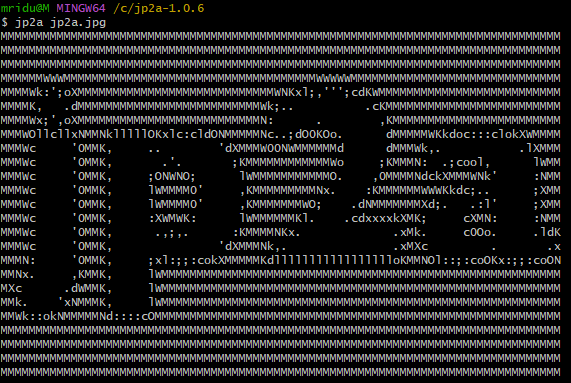
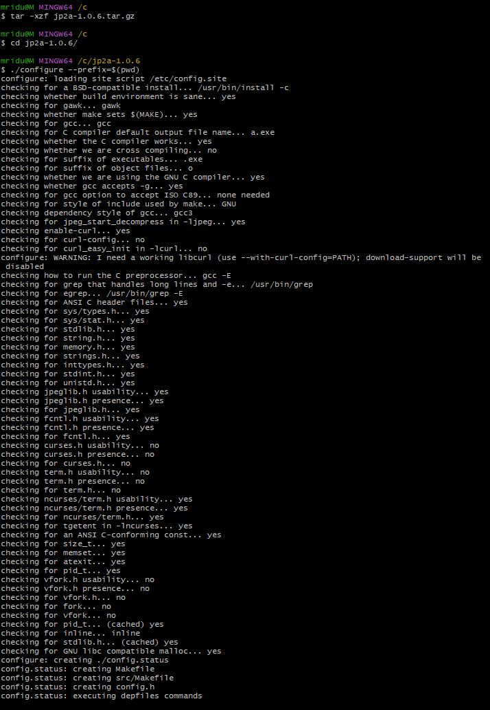
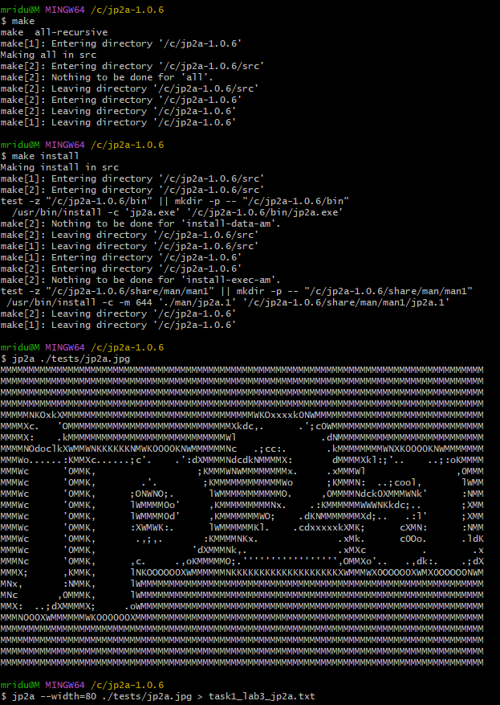
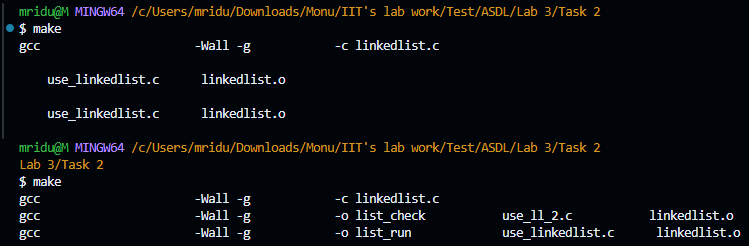
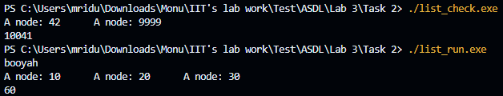
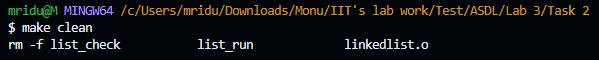

# Documentation of Task 1

# Documentation for Installing and Running jp2a

## Overview
`jp2a` is an open-source software tool that converts JPEG images into ASCII art. This documentation outlines the steps taken to download, compile, and run `jp2a` on a Windows 11 system using MSYS2 MINGW64.

## Prerequisites
- Windows 11
- MSYS2 installed (for managing dependencies and providing a Unix-like environment)

## Step-by-Step Installation Guide

### Step 1: Download the jp2a Source Code

1. **Download the jp2a tar.gz file:**
   You can download the source code for jp2a from the official SourceForge page:
   ```
   https://sourceforge.net/projects/jp2a/files/jp2a/1.0.6/
   ```

### Step 2: Extract the Downloaded File

2. **Open MSYS2 MINGW64 terminal and navigate to the directory where the file was downloaded.**

3. **Extract the tar.gz file:**
   ```bash
   tar -xzf jp2a-1.0.6.tar.gz
   ```

### Step 3: Change Directory

4. **Navigate to the extracted directory:**
   ```bash
   cd /c/jp2a-1.0.6
   ```

### Step 4: Configure the Build Environment

5. **Run the configure script:**
   This step prepares the build environment and checks for necessary dependencies.
   ```bash
   ./configure --prefix=$(pwd)
   ```

   **Output Explanation:**
   - The output indicates that the configuration was successful and lists the checks performed, including verifying the presence of the JPEG library and ncurses.

### Step 5: Compile the Program

6. **Compile the source code using make:**
   ```bash
   make
   ```

   **Output Explanation:**
   - The output shows the compilation process, including compiling individual source files and linking them into the final executable `jp2a.exe`.

### Step 6: Install the Program

7. **Install the compiled program:**
   ```bash
   make install
   ```

   **Output Explanation:**
   - The installation process creates the necessary directories and copies the executable to the specified bin directory.

### Step 7: Convert a JPEG Image to ASCII

8. **Run jp2a on a JPEG image:**
    ```bash
    jp2a tests/jp2a.jpg
    ```
    The issue that can occur here is that the jp2a executable you built is named jp2a.exe, which is common on Windows. However, when you try to run jp2a without the .exe extension, the shell cannot find the executable.

   ### Steps to Resolve the Issue:

   1. *Run the Executable with .exe Extension:*
      - Since you are on a Windows system, you need to specify the .exe extension when running the program.
      - Try running this inside bin folder:
      bash
      ./jp2a.exe ../tests/jp2a.jpg
      

   2. *Add bin Directory to Your PATH:*
      - To run jp2a.exe from any directory without specifying the full path, add the bin directory to your PATH environment variable.
      - You can do this by editing your .bashrc, .bash_profile, or .profile file (whichever is applicable) to include the following line:
      bash
      export PATH=$PATH:/path/to/jp2a-1.0.6/bin
      
      - After adding this line, reload your shell configuration:
      bash
      source ~/.bashrc
      
      - Now you should be able to run jp2a.exe from anywhere by typing:
      bash
      jp2a.exe ../tests/jp2a.jpg

   **Output Explanation:**
   - The program outputs ASCII art representation of the specified JPEG image to the console.

### Example Output

Here is an example of the ASCII art generated from the image:

Input Image


Output Image



### Step 8: Capture the Output to a File

9. **Redirect the output to a text file:**
    ```bash
    jp2a jp2a.jpg > task1_lab3_jp2a.txt
    ```
## Command line screenshot




## Conclusion

By following the steps outlined in this documentation, you successfully installed and ran the `jp2a` program on your Windows 11 system using MSYS2 MINGW64. You can now convert JPEG images to ASCII art using the command line.

# Documentation of Task 2

# Documentation for Task 2: Makefile Creation

## Overview

This documentation outlines the solution for Task 2, which involves creating a Makefile for a C program that includes a linked list library. The Makefile is designed to compile the library and two client programs, ensuring that all dependencies are correctly managed.

## Project Structure

The project includes the following files:

- `linkedlist.c`: Source code for the linked list library.
- `linkedlist.h`: Header file for the linked list library.
- `use_ll_2.c`: Client program that utilizes the linked list library.
- `use_linkedlist.c`: Another client program that utilizes the linked list library.
- `Makefile`: The Makefile that automates the build process.

## Full Makefile Code

```makefile
# Makefile for linked list library and client programs

# Variables
CC      = gcc                     # Compiler
CFLAGS  = -Wall -g                # Compiler flags
SRC     = linkedlist.c            # Source file for the linked list library
OBJ     = linkedlist.o            # Object file for the linked list library
EXE1    = list_check               # First executable
EXE2    = list_run                 # Second executable
SRC1    = use_ll_2.c              # Source for list_check
SRC2    = use_linkedlist.c         # Source for list_run

# Default target
all: $(EXE1) $(EXE2)

# Build linkedlist.o from linkedlist.c
$(OBJ): $(SRC) linkedlist.h
	$(CC) $(CFLAGS) -c $<  # Using $< to refer to the first prerequisite

# Build list_check from use_ll_2.c and linkedlist.o
$(EXE1): $(SRC1) $(OBJ)
	$(CC) $(CFLAGS) -o $@ $^  # Using $@ for target name and $^ for all prerequisites

# Build list_run from use_linkedlist.c and linkedlist.o
$(EXE2): $(SRC2) $(OBJ)
	$(CC) $(CFLAGS) -o $@ $^  # Using $@ for target name and $^ for all prerequisites

# Clean target to remove executables and object files
clean:
	rm -f $(EXE1) $(EXE2) $(OBJ)

.PHONY: all clean  # Declaring phony targets
```

## Explanation of the Makefile

### Variables

```makefile
# Variables
CC      = gcc                     # Compiler
CFLAGS  = -Wall -g                # Compiler flags
SRC     = linkedlist.c            # Source file for the linked list library
OBJ     = linkedlist.o            # Object file for the linked list library
EXE1    = list_check               # First executable
EXE2    = list_run                 # Second executable
SRC1    = use_ll_2.c              # Source for list_check
SRC2    = use_linkedlist.c         # Source for list_run
```

- **`CC`**: Specifies the compiler to use (GCC).
- **`CFLAGS`**: Compiler flags that enable all warnings (`-Wall`) and include debugging information (`-g`).
- **`SRC`**: The source file for the linked list library.
- **`OBJ`**: The name of the object file generated from the linked list source code (`linkedlist.o`).
- **`EXE1`** and **`EXE2`**: Names of the executables to be created (`list_check` and `list_run`).
- **`SRC1`** and **`SRC2`**: Source files for the client programs.

### Default Target

```makefile
# Default target
all: $(EXE1) $(EXE2)
```

The `all` target is the default target that will be executed when you run `make` without any arguments. It specifies that both `list_check` and `list_run` executables should be built.

### Object File Target

```makefile
# Build linkedlist.o from linkedlist.c
$(OBJ): $(SRC) linkedlist.h
	$(CC) $(CFLAGS) -c $<  # Using $< to refer to the first prerequisite
```

This rule defines how to build the `linkedlist.o` object file:

- **Dependencies**: It depends on `linkedlist.c` and `linkedlist.h`. If either of these files changes, `linkedlist.o` will be rebuilt.
- **Command**: The command `$(CC) $(CFLAGS) -c $<` compiles `linkedlist.c` into an object file (`linkedlist.o`) using the specified compiler and flags. The special variable `$<` refers to the first prerequisite (`linkedlist.c`).

### Executable Targets

```makefile
# Build list_check from use_ll_2.c and linkedlist.o
$(EXE1): $(SRC1) $(OBJ)
	$(CC) $(CFLAGS) -o $@ $^  # Using $@ for target name and $^ for all prerequisites
```

This rule builds the `list_check` executable:

- **Dependencies**: It depends on `use_ll_2.c` and `linkedlist.o`. If either of these files is modified, the executable will be rebuilt.
- **Command**: The command `$(CC) $(CFLAGS) -o $@ $^` compiles `use_ll_2.c` and links it with `linkedlist.o` to create the `list_check` executable. The special variable `$@` refers to the target name (`list_check`), and `$^` refers to all prerequisites.

```makefile
# Build list_run from use_linkedlist.c and linkedlist.o
$(EXE2): $(SRC2) $(OBJ)
	$(CC) $(CFLAGS) -o $@ $^  # Using $@ for target name and $^ for all prerequisites
```

This rule is similar to the previous one but builds the `list_run` executable:

- **Dependencies**: It depends on `use_linkedlist.c` and `linkedlist.o`.
- **Command**: The command compiles `use_linkedlist.c` and links it with `linkedlist.o` to create the `list_run` executable.

### Clean Target

```makefile
# Clean target to remove executables and object files
clean:
	rm -f $(EXE1) $(EXE2) $(OBJ)
```

The `clean` target is used to remove the compiled executables and object files:

- **Command**: The command `rm -f $(EXE1) $(EXE2) $(OBJ)` deletes the files specified by the variables `$(EXE1)`, `$(EXE2)`, and `$(OBJ)`. The `-f` option prevents errors if the files do not exist.

### Phony Targets

```makefile
.PHONY: all clean  # Declaring phony targets
```

The `.PHONY` directive declares `all` and `clean` as phony targets. This means that these targets do not correspond to actual files, and Make will always execute the commands associated with these targets, regardless of whether files with the same names exist.

## Running the Compiled Programs

After compiling the programs using the Makefile, you can run the executables to see their output.

### Running `list_check.exe`

```bash
PS C:\Users\mridu\Downloads\Monu\IIT's lab work\Test\ASDL\Lab 3\Task 2> ./list_check.exe
A node: 42      A node: 9999
10041
```

- **Output Explanation**: The program outputs the values of nodes in the linked list and a sum (or some operation result) based on the linked list's contents.

### Running `list_run.exe`

```bash
PS C:\Users\mridu\Downloads\Monu\IIT's lab work\Test\ASDL\Lab 3\Task 2> ./list_run.exe
booyah
A node: 10      A node: 20      A node: 30
60
```

- **Output Explanation**: The program outputs a string (`booyah`), the values of nodes in the linked list, and a sum (or some operation result) based on the linked list's contents.

## Usage

1. **Compiling the Programs**: 
   - To compile the programs, navigate to the directory containing the Makefile and run:
     ```bash
     make
     ```

2. **Cleaning Up**: 
   - To remove the compiled executables and object files, run:
     ```bash
     make clean
     ```

## Command line screenshot






## Requirements

- **Environment**: The Makefile is designed to be used in a Unix-like environment, such as Linux or MSYS2 on Windows.
- **Dependencies**: Ensure that GCC and Make are installed and accessible in your terminal.

## Conclusion

This Makefile efficiently manages the compilation of a linked list library and its client programs, ensuring that all dependencies are handled correctly. By following the instructions in this documentation, users can easily compile and clean their projects. The example outputs demonstrate the functionality of the compiled programs.

# Documentation of Task 3

# Documentation for Task 3: Debugging `insertion.c` and `selection.c`

This document provides a detailed explanation of the debugging process for the `insertion.c` and `selection.c` programs. It includes the full code for both files, the commands used in gdb, the corrections made to resolve issues, and the reasoning behind each change based on gdb messages.

## Overview

The purpose of this task was to debug two sorting algorithms: insertion sort and selection sort. The debugging process involved using the GNU Debugger (gdb) to identify and fix logical errors and segmentation faults in the implementations.

## Debugging `insertion.c`

### Initial Code

The initial version of `insertion.c` contained logical errors in the insertion sort implementation. Here’s the original code snippet:

```c
#include <stdio.h>

void insertion_sort(int A[], int size) {
    for (int i = 1; i < size; i++) {
        int j = i;
        while (j >= 0 && A[j] < A[j-1]) { // Incorrect condition
            int temp = A[j];
            A[j] = A[j-1];
            A[j-1] = temp;
            j--;
        }
    }
}

int main() {
    int length = 8;
    int list[] = { 28, 4, 100, 9, 224, 111, 72, 53 };
    printf("unsorted list: \n");
    for (int i = 0; i < length; i++) {
        printf("%10d\n", list[i]);
    }

    insertion_sort(list, length);
    printf("list in order: \n");
    for (int i = 0; i < length; i++) {
        printf("%10d\n", list[i]);
    }

    return 0;
}
```

### gdb Commands Used

1. **Compile the Program with Debugging Information**:
   ```bash
   gcc -g insertion.c -o insertion
   ```

2. **Start gdb**:
   ```bash
   gdb ./insertion
   ```

3. **Run the Program**:
   ```gdb
   run
   ```

4. **Set Breakpoints**:
   Set a breakpoint at the `main` function:
   ```gdb
   break main
   ```

5. **Continue Execution**:
   After hitting the breakpoint:
   ```gdb
   continue
   ```

6. **Step into the `insertion_sort` Function**:
   Set a breakpoint in the `insertion_sort` function:
   ```gdb
   break insertion_sort
   continue
   ```

7. **Step Through the Code**:
   Use the `step` command to go through the lines of the `insertion_sort` function:
   ```gdb
   step
   ```

### Identified Issues and Fixes

1. **Incorrect Loop Condition**:
   The condition in the `while` loop should be:
   ```c
   while (j > 0 && A[j] < A[j-1]) { // Correct condition
   ```
   **Reason for Change**: The original condition `j >= 0` could lead to an out-of-bounds access when `j` is `0`, which would cause undefined behavior. The corrected condition ensures that `j` is always greater than `0` before accessing `A[j-1]`.

### Corrected Code for `insertion.c`

Here’s the corrected version of the `insertion.c` code:

```c
#include <stdio.h>

void insertion_sort(int A[], int size) {
    for (int i = 1; i < size; i++) {
        int j = i;
        while (j > 0 && A[j] < A[j-1]) { // Corrected condition
            int temp = A[j];
            A[j] = A[j-1];
            A[j-1] = temp;
            j--;
        }
    }
}

int main() {
    int length = 8;
    int list[] = { 28, 4, 100, 9, 224, 111, 72, 53 };
    printf("unsorted list: \n");
    for (int i = 0; i < length; i++) {
        printf("%10d\n", list[i]);
    }

    insertion_sort(list, length);
    printf("list in order: \n");
    for (int i = 0; i < length; i++) {
        printf("%10d\n", list[i]);
    }

    return 0;
}
```

### Final Output

After making the necessary corrections, the output of the program should correctly display the sorted list.

## Debugging `selection.c`

### Initial Code

The initial version of `selection.c` also contained logical errors. Here’s the original code snippet:

```c
#include <stdio.h>

void selection_sort(int A[], int size) {
    int i, j, max, temp;

    for (i = size - 1; i > 0; i--) {
        max = 0;
        for (j = 1; i <= size; j++) { // Incorrect condition
            if (A[j] > A[max])
                max = j;
        }
        temp = A[max];
        A[max] = A[i];
        A[i] = temp;
    }
}

int binary_search(int item, int A[], int size) {
    int lo = 0; 
    int hi = size; // Incorrect initialization
    while (1) {
        if (hi < lo)
            return 0; // not found
        int mid = (hi + lo) / 2;
        if (A[mid] == item)
            return 1; // found
        if (item < A[mid])
            hi = mid; // move hi to eliminate 2nd half of A
        else
            lo = mid; // move lo to eliminate 1st half of A
    }
}

int main() {
    int list[] = { 100, 45, 89, 27, 317, 17 };
    printf("unsorted list: \n");
    for (int i = 0; i < 6; i++) {
        printf("%10d\n", list[i]);
    }

    selection_sort(list, 6);
    printf("list in order: \n");
    for (int i = 0; i < 6; i++) {
        printf("%10d\n", list[i]);
    }

    printf("test if 42 is in the array...\n");
    if (binary_search(42, list, 6))
        printf(" YES\n");
    else
        printf(" NO\n");

    return 0;
}
```

### gdb Commands Used

1. **Compile the Program with Debugging Information**:
   ```bash
   gcc -g selection.c -o selection
   ```

2. **Start gdb**:
   ```bash
   gdb ./selection
   ```

3. **Run the Program**:
   ```gdb
   run
   ```

4. **Set Breakpoints**:
   Set a breakpoint at the `main` function:
   ```gdb
   break main
   ```

5. **Continue Execution**:
   After hitting the breakpoint:
   ```gdb
   continue
   ```

6. **Step into the `selection_sort` Function**:
   Set a breakpoint in the `selection_sort` function:
   ```gdb
   break selection_sort
   continue
   ```

7. **Step Through the Code**:
   Use the `step` command to go through the lines of the `selection_sort` function:
   ```gdb
   step
   ```

### Identified Issues and Fixes

1. **Segmentation Fault**:
   The segmentation fault was caused by an incorrect loop condition in the `selection_sort` function. The condition should be changed from:
   ```c
   for (j = 1; i <= size; j++)
   ```
   To:
   ```c
   for (j = 1; j <= i; j++)
   ```
   **Reason for Change**: The original condition `i <= size` caused the loop to run out of bounds, leading to a segmentation fault. The corrected condition ensures that `j` iterates correctly within the bounds of the array.

2. **Correct Binary Search Logic**:
   Ensure that `hi` is initialized correctly in the `binary_search` function:
   ```c
   int hi = size - 1; // Correct initialization
   ```

3. **Ensure Proper Swapping Logic**:
   Make sure that the swapping logic is outside the inner loop after finding the maximum index.

### Corrected Code for `selection.c`

Here’s the corrected version of the `selection.c` code:

```c
#include <stdio.h>

void selection_sort(int A[], int size) {
    int i, j, max, temp;

    for (i = size - 1; i > 0; i--) {
        max = 0; // Assume the first element is the largest
        for (j = 1; j <= i; j++) { // Correct condition
            if (A[j] > A[max]) {
                max = j; // Update max if a larger element is found
            }
        }
        // Swap the found maximum element with the last element
        temp = A[max];
        A[max] = A[i];
        A[i] = temp;
    }
}

int binary_search(int item, int A[], int size) {
    int lo = 0; 
    int hi = size - 1; // Correct initialization
    while (lo <= hi) { // Correct loop condition
        int mid = (hi + lo) / 2;
        if (A[mid] == item)
            return 1; // found
        if (item < A[mid])
            hi = mid - 1; // Move hi to eliminate 2nd half of A
        else
            lo = mid + 1; // Move lo to eliminate 1st half of A
    }
    return 0; // not found
}

int main() {
    int list[] = {100, 45, 89, 27, 317, 17};
    printf("unsorted list: \n");
    for (int i = 0; i < 6; i++) {
        printf("%10d\n", list[i]);
    }

    selection_sort(list, 6);
    printf("list in order: \n");
    for (int i = 0; i < 6; i++) {
        printf("%10d\n", list[i]);
    }

    printf("test if 42 is in the array...\n");
    if (binary_search(42, list, 6))
        printf(" YES\n");
    else
        printf(" NO\n");

    return 0;
}
```

### Final Output

After making the necessary corrections, the output of the program should correctly display the sorted list:

```
unsorted list: 
       100
        45
        89
        27
       317
        17
list in order: 
        17
        27
        45
        89
       100
       317
```

## Conclusion

This documentation provides a comprehensive overview of the debugging process for both `insertion.c` and `selection.c`. By utilizing gdb effectively, we identified and resolved segmentation faults and logical errors, ensuring that both sorting algorithms function correctly. The full code for both programs is included for reference, along with the commands used throughout the debugging process.

### Interpreting gdb Messages

Understanding the messages from gdb is crucial for effective debugging. Here are some key points on how to interpret these messages:

- **Segmentation Fault**: This indicates that the program tried to access memory that it shouldn't. This usually happens when an array index is out of bounds. You should check your loop conditions and ensure they do not exceed the array limits.

- **Backtrace**: When you use the `backtrace` command after a crash, it shows the call stack leading to the error. This helps you identify which function caused the problem.

- **Variable Inspection**: Using the `print` command allows you to check the values of variables at any point in your code. This is useful for understanding the state of your program and identifying logical errors.

By following these guidelines and understanding the feedback from gdb, you can effectively debug your C programs and enhance your coding skills.

# Documentation of Task 4

# Documentation for t4_msg.c

## Introduction
The `t4_msg.c` program is designed to decode a secret message using the ROT13 cipher. It includes two functions: `len` to calculate the length of a string and `rot13` to perform the ROT13 transformation on a character.

## Steps to Complete the Task

### Step 1: Download the Source C File
Make sure to download the source C file named `t4_msg.c` to your working directory.

### Step 2: Create a Makefile
Create a file named `Makefile` in the same directory as `t4_msg.c`. Here is a sample Makefile with the required targets:

```Makefile
# Makefile for t4_msg program

# Compiler
CC = gcc

# Compiler flags
CFLAGS = -Wall

# Targets
TARGET = program
SRC = t4_msg.c

# Release target
release: $(TARGET)

$(TARGET): $(SRC)
	$(CC) $(CFLAGS) -o $(TARGET) $(SRC)

# Debug target
debug: CFLAGS += -g
debug: $(TARGET)

clean:
	rm -f $(TARGET)
```

### Explanation of the Makefile:
- **CC**: Specifies the compiler to use (GCC).
- **CFLAGS**: Compiler flags; `-Wall` enables all compiler's warning messages.
- **TARGET**: The name of the output executable.
- **SRC**: The source file.
- **release**: Compiles the program normally.
- **debug**: Compiles the program with debug symbols (`-g`).
- **clean**: A target to remove the compiled executable.

### Step 3: Build and Run the Program
Run the following commands in your terminal:

```bash
make debug
./program
```

### Expected Output
After running the corrected program, the output should be:

```
The secret message is: Well Done!!!
```

The encoded message "Jryy Qbar!!!" is decoded using ROT13 and displayed as "Well Done!!!".

## Incorrect Code
The initial version of `t4_msg.c` had a bug in the `len` function:

```c
int len(char* s) {
  int l = 0;
  while (*s) s++;
  return l;
}
```

In this implementation, the `len` function increments the pointer `s` for each character in the string but never updates the length counter `l`. As a result, the function always returns 0, leading to incorrect behavior in the main function.

## Corrected Code
Here's the corrected version of `t4_msg.c`:

```c
#include <stdio.h>

int len(char* s) {
  int l = 0;
  while (*s++) l++;  // Increment l for each character in the string
  return l;
}

int rot13(int l) {
  if (l >= 'A' && l <= 'Z') l = (l - 'A' + 13) % 26 + 'A';
  if (l >= 'a' && l <= 'z') l = (l - 'a' + 13) % 26 + 'a';
  return l;
}

char* msg = "Jryy Qbar!!!\n";

int main() {
  int i = 0;
  printf("The secret message is: ");
  while (i < len(msg)) printf("%c", rot13(msg[i++]));

  return 0;
}
```

### Changes Made
1. In the `len` function, I modified the while loop to increment the length counter `l` for each character using `l++;` inside the loop.
2. The post-increment operator `s++` is used to move the pointer to the next character in the string after checking the current character.

### Explanation
The corrected `len` function now correctly calculates the length of the string by incrementing the `l` variable for each character in the string. The loop continues until it reaches the null terminator `\0`.

The `rot13` function remains unchanged. It takes a character as input and applies the ROT13 transformation if the character is an uppercase or lowercase letter. The transformation is done by shifting the character by 13 positions within its respective case range (A-Z or a-z).

In the `main` function, the program first prints the message "The secret message is: ". Then, it enters a loop that iterates from 0 to the length of the `msg` string (calculated using the corrected `len` function). Inside the loop, it applies the `rot13` function to each character of the `msg` string and prints the transformed character.

## Conclusion
The corrected version of `t4_msg.c` fixes the bug in the `len` function by properly incrementing the length counter. This ensures that the program correctly calculates the length of the string and applies the ROT13 transformation to decode the secret message.