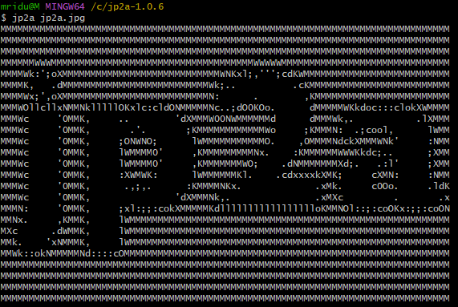
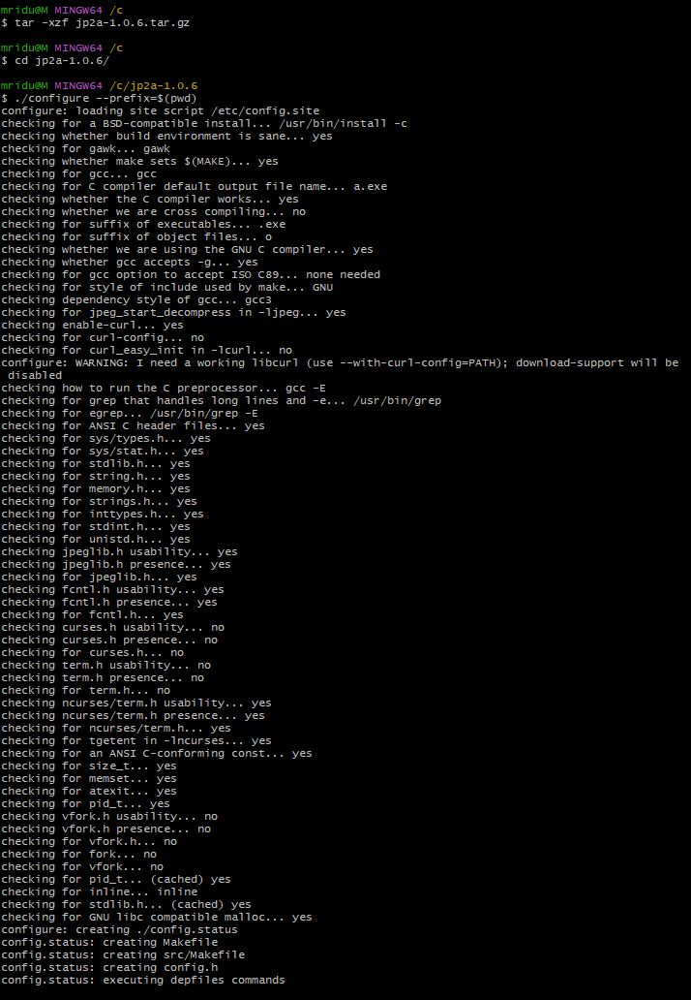
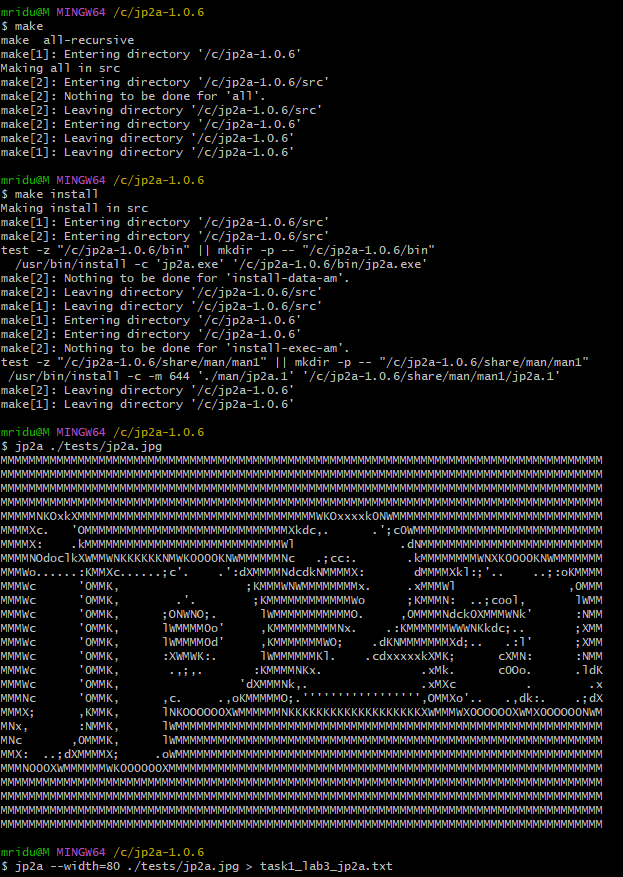

# Documentation for Installing and Running jp2a

## Overview
`jp2a` is an open-source software tool that converts JPEG images into ASCII art. This documentation outlines the steps taken to download, compile, and run `jp2a` on a Windows 11 system using MSYS2 MINGW64.

## Prerequisites
- Windows 11
- MSYS2 installed (for managing dependencies and providing a Unix-like environment)

## Step-by-Step Installation Guide

### Step 1: Download the jp2a Source Code

1. **Download the jp2a tar.gz file:**
   You can download the source code for jp2a from the official SourceForge page:
   ```
   https://sourceforge.net/projects/jp2a/files/jp2a/1.0.6/
   ```

### Step 2: Extract the Downloaded File

2. **Open MSYS2 MINGW64 terminal and navigate to the directory where the file was downloaded.**

3. **Extract the tar.gz file:**
   ```bash
   tar -xzf jp2a-1.0.6.tar.gz
   ```

### Step 3: Change Directory

4. **Navigate to the extracted directory:**
   ```bash
   cd /c/jp2a-1.0.6
   ```

### Step 4: Configure the Build Environment

5. **Run the configure script:**
   This step prepares the build environment and checks for necessary dependencies.
   ```bash
   ./configure --prefix=$(pwd)
   ```

   **Output Explanation:**
   - The output indicates that the configuration was successful and lists the checks performed, including verifying the presence of the JPEG library and ncurses.

### Step 5: Compile the Program

6. **Compile the source code using make:**
   ```bash
   make
   ```

   **Output Explanation:**
   - The output shows the compilation process, including compiling individual source files and linking them into the final executable `jp2a.exe`.

### Step 6: Install the Program

7. **Install the compiled program:**
   ```bash
   make install
   ```

   **Output Explanation:**
   - The installation process creates the necessary directories and copies the executable to the specified bin directory.

### Step 7: Convert a JPEG Image to ASCII

8. **Run jp2a on a JPEG image:**
    ```bash
    jp2a tests/jp2a.jpg
    ```
    The issue that can occur here is that the jp2a executable you built is named jp2a.exe, which is common on Windows. However, when you try to run jp2a without the .exe extension, the shell cannot find the executable.

   ### Steps to Resolve the Issue:

   1. *Run the Executable with .exe Extension:*
      - Since you are on a Windows system, you need to specify the .exe extension when running the program.
      - Try running this inside bin folder:
      bash
      ./jp2a.exe ../tests/jp2a.jpg
      

   2. *Add bin Directory to Your PATH:*
      - To run jp2a.exe from any directory without specifying the full path, add the bin directory to your PATH environment variable.
      - You can do this by editing your .bashrc, .bash_profile, or .profile file (whichever is applicable) to include the following line:
      bash
      export PATH=$PATH:/path/to/jp2a-1.0.6/bin
      
      - After adding this line, reload your shell configuration:
      bash
      source ~/.bashrc
      
      - Now you should be able to run jp2a.exe from anywhere by typing:
      bash
      jp2a.exe ../tests/jp2a.jpg

   **Output Explanation:**
   - The program outputs ASCII art representation of the specified JPEG image to the console.

### Example Output

Here is an example of the ASCII art generated from the image:

Input Image


Output Image



### Step 8: Capture the Output to a File

9. **Redirect the output to a text file:**
    ```bash
    jp2a jp2a.jpg > task1_lab3_jp2a.txt
    ```
## Command line screenshot




## Conclusion

By following the steps outlined in this documentation, you successfully installed and ran the `jp2a` program on your Windows 11 system using MSYS2 MINGW64. You can now convert JPEG images to ASCII art using the command line.