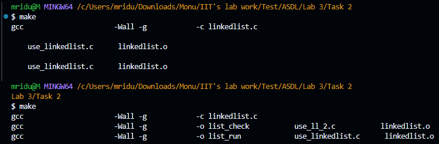
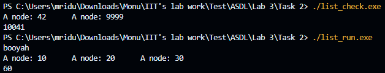
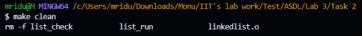

# Documentation for Task 2: Makefile Creation

## Overview

This documentation outlines the solution for Task 2, which involves creating a Makefile for a C program that includes a linked list library. The Makefile is designed to compile the library and two client programs, ensuring that all dependencies are correctly managed.

## Project Structure

The project includes the following files:

- `linkedlist.c`: Source code for the linked list library.
- `linkedlist.h`: Header file for the linked list library.
- `use_ll_2.c`: Client program that utilizes the linked list library.
- `use_linkedlist.c`: Another client program that utilizes the linked list library.
- `Makefile`: The Makefile that automates the build process.

## Full Makefile Code

```makefile
# Makefile for linked list library and client programs

# Variables
CC      = gcc                     # Compiler
CFLAGS  = -Wall -g                # Compiler flags
SRC     = linkedlist.c            # Source file for the linked list library
OBJ     = linkedlist.o            # Object file for the linked list library
EXE1    = list_check               # First executable
EXE2    = list_run                 # Second executable
SRC1    = use_ll_2.c              # Source for list_check
SRC2    = use_linkedlist.c         # Source for list_run

# Default target
all: $(EXE1) $(EXE2)

# Build linkedlist.o from linkedlist.c
$(OBJ): $(SRC) linkedlist.h
	$(CC) $(CFLAGS) -c $<  # Using $< to refer to the first prerequisite

# Build list_check from use_ll_2.c and linkedlist.o
$(EXE1): $(SRC1) $(OBJ)
	$(CC) $(CFLAGS) -o $@ $^  # Using $@ for target name and $^ for all prerequisites

# Build list_run from use_linkedlist.c and linkedlist.o
$(EXE2): $(SRC2) $(OBJ)
	$(CC) $(CFLAGS) -o $@ $^  # Using $@ for target name and $^ for all prerequisites

# Clean target to remove executables and object files
clean:
	rm -f $(EXE1) $(EXE2) $(OBJ)

.PHONY: all clean  # Declaring phony targets
```

## Explanation of the Makefile

### Variables

```makefile
# Variables
CC      = gcc                     # Compiler
CFLAGS  = -Wall -g                # Compiler flags
SRC     = linkedlist.c            # Source file for the linked list library
OBJ     = linkedlist.o            # Object file for the linked list library
EXE1    = list_check               # First executable
EXE2    = list_run                 # Second executable
SRC1    = use_ll_2.c              # Source for list_check
SRC2    = use_linkedlist.c         # Source for list_run
```

- **`CC`**: Specifies the compiler to use (GCC).
- **`CFLAGS`**: Compiler flags that enable all warnings (`-Wall`) and include debugging information (`-g`).
- **`SRC`**: The source file for the linked list library.
- **`OBJ`**: The name of the object file generated from the linked list source code (`linkedlist.o`).
- **`EXE1`** and **`EXE2`**: Names of the executables to be created (`list_check` and `list_run`).
- **`SRC1`** and **`SRC2`**: Source files for the client programs.

### Default Target

```makefile
# Default target
all: $(EXE1) $(EXE2)
```

The `all` target is the default target that will be executed when you run `make` without any arguments. It specifies that both `list_check` and `list_run` executables should be built.

### Object File Target

```makefile
# Build linkedlist.o from linkedlist.c
$(OBJ): $(SRC) linkedlist.h
	$(CC) $(CFLAGS) -c $<  # Using $< to refer to the first prerequisite
```

This rule defines how to build the `linkedlist.o` object file:

- **Dependencies**: It depends on `linkedlist.c` and `linkedlist.h`. If either of these files changes, `linkedlist.o` will be rebuilt.
- **Command**: The command `$(CC) $(CFLAGS) -c $<` compiles `linkedlist.c` into an object file (`linkedlist.o`) using the specified compiler and flags. The special variable `$<` refers to the first prerequisite (`linkedlist.c`).

### Executable Targets

```makefile
# Build list_check from use_ll_2.c and linkedlist.o
$(EXE1): $(SRC1) $(OBJ)
	$(CC) $(CFLAGS) -o $@ $^  # Using $@ for target name and $^ for all prerequisites
```

This rule builds the `list_check` executable:

- **Dependencies**: It depends on `use_ll_2.c` and `linkedlist.o`. If either of these files is modified, the executable will be rebuilt.
- **Command**: The command `$(CC) $(CFLAGS) -o $@ $^` compiles `use_ll_2.c` and links it with `linkedlist.o` to create the `list_check` executable. The special variable `$@` refers to the target name (`list_check`), and `$^` refers to all prerequisites.

```makefile
# Build list_run from use_linkedlist.c and linkedlist.o
$(EXE2): $(SRC2) $(OBJ)
	$(CC) $(CFLAGS) -o $@ $^  # Using $@ for target name and $^ for all prerequisites
```

This rule is similar to the previous one but builds the `list_run` executable:

- **Dependencies**: It depends on `use_linkedlist.c` and `linkedlist.o`.
- **Command**: The command compiles `use_linkedlist.c` and links it with `linkedlist.o` to create the `list_run` executable.

### Clean Target

```makefile
# Clean target to remove executables and object files
clean:
	rm -f $(EXE1) $(EXE2) $(OBJ)
```

The `clean` target is used to remove the compiled executables and object files:

- **Command**: The command `rm -f $(EXE1) $(EXE2) $(OBJ)` deletes the files specified by the variables `$(EXE1)`, `$(EXE2)`, and `$(OBJ)`. The `-f` option prevents errors if the files do not exist.

### Phony Targets

```makefile
.PHONY: all clean  # Declaring phony targets
```

The `.PHONY` directive declares `all` and `clean` as phony targets. This means that these targets do not correspond to actual files, and Make will always execute the commands associated with these targets, regardless of whether files with the same names exist.

## Running the Compiled Programs

After compiling the programs using the Makefile, you can run the executables to see their output.

### Running `list_check.exe`

```bash
PS C:\Users\mridu\Downloads\Monu\IIT's lab work\Test\ASDL\Lab 3\Task 2> ./list_check.exe
A node: 42      A node: 9999
10041
```

- **Output Explanation**: The program outputs the values of nodes in the linked list and a sum (or some operation result) based on the linked list's contents.

### Running `list_run.exe`

```bash
PS C:\Users\mridu\Downloads\Monu\IIT's lab work\Test\ASDL\Lab 3\Task 2> ./list_run.exe
booyah
A node: 10      A node: 20      A node: 30
60
```

- **Output Explanation**: The program outputs a string (`booyah`), the values of nodes in the linked list, and a sum (or some operation result) based on the linked list's contents.

## Usage

1. **Compiling the Programs**: 
   - To compile the programs, navigate to the directory containing the Makefile and run:
     ```bash
     make
     ```

2. **Cleaning Up**: 
   - To remove the compiled executables and object files, run:
     ```bash
     make clean
     ```

## Command line screenshot






## Requirements

- **Environment**: The Makefile is designed to be used in a Unix-like environment, such as Linux or MSYS2 on Windows.
- **Dependencies**: Ensure that GCC and Make are installed and accessible in your terminal.

## Conclusion

This Makefile efficiently manages the compilation of a linked list library and its client programs, ensuring that all dependencies are handled correctly. By following the instructions in this documentation, users can easily compile and clean their projects. The example outputs demonstrate the functionality of the compiled programs.